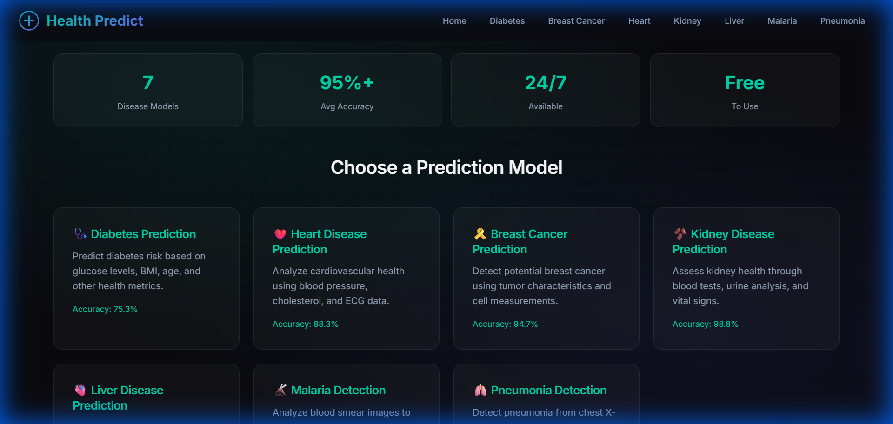

# Health Predict - AI Disease Prediction Platform

A modern, AI-powered disease prediction web application built with Flask and Machine Learning. Predict various diseases using trained ML models with a beautiful, responsive dark-themed interface.



## 🌟 Features

- **7 Disease Prediction Models**
  - 🩺 Diabetes Prediction (75.3% accuracy)
  - ❤️ Heart Disease Prediction (88.3% accuracy)
  - 🎗️ Breast Cancer Detection (94.7% accuracy)
  - 🫘 Kidney Disease Prediction (98.8% accuracy)
  - 🫀 Liver Disease Prediction (66.4% accuracy)
  - 🦟 Malaria Detection from Blood Smear Images (95.6% accuracy)
  - 🫁 Pneumonia Detection from Chest X-rays (91.4% accuracy)

- **Modern UI/UX**
  - 🌙 Dark "Midnight Medical" theme
  - ✨ Glassmorphism effects
  - 💫 Smooth animations
  - 📱 Fully responsive design

## 🚀 Tech Stack

- **Backend**: Python, Flask
- **ML Models**: scikit-learn, TensorFlow
- **Frontend**: HTML5, CSS3, JavaScript
- **Styling**: Custom CSS with CSS Variables

## 📦 Installation

1. Clone the repository:
```bash
git clone https://github.com/yourusername/health-predict.git
cd health-predict
```

2. Install dependencies:
```bash
pip install -r requirements.txt
```

3. Run the application:
```bash
python app.py
```

4. Open your browser and navigate to `http://127.0.0.1:5000`

## 📋 Requirements

- Python 3.8+
- Flask 2.1.2
- NumPy 1.23.5
- scikit-learn 1.1.3
- TensorFlow 2.9.1
- Pillow 9.1.1

## 🎯 Usage

1. Select a disease prediction model from the home page
2. Enter the required health metrics in the form
3. Click "Predict Now" to get the prediction result
4. View the result (Positive/Negative) with visual feedback

## 📊 Model Information

| Model | Features | Accuracy |
|-------|----------|----------|
| Diabetes | 8 health metrics | 75.3% |
| Heart Disease | 13 cardiovascular metrics | 88.3% |
| Breast Cancer | 22 tumor characteristics | 94.7% |
| Kidney Disease | 24 kidney function tests | 98.8% |
| Liver Disease | 10 liver function tests | 66.4% |
| Malaria | Blood smear image analysis | 95.6% |
| Pneumonia | Chest X-ray image analysis | 91.4% |

## ⚠️ Disclaimer

This application is for **educational purposes only**. The predictions made by these models should not be used as a substitute for professional medical advice, diagnosis, or treatment. Always consult a qualified healthcare provider for medical concerns.

## 📄 License

This project is licensed under the MIT License - see the [LICENSE](LICENSE) file for details.

## 👨‍💻 Author

Made with ❤️ by **Sushil**

---

© 2025 Health Predict. All rights reserved.
